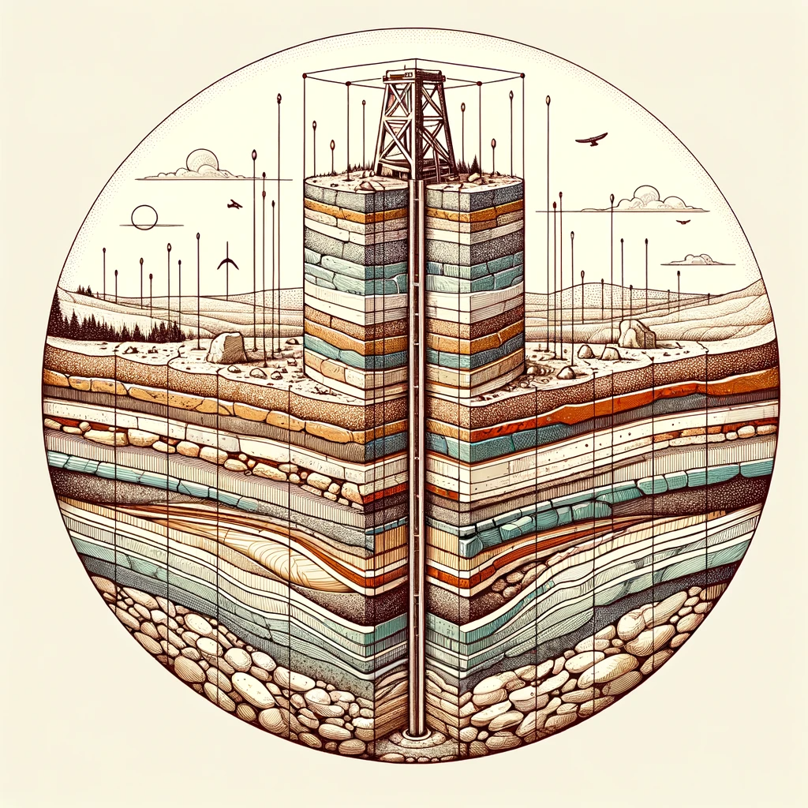

# Lithology Classificaiton 

### Objective
The purpose of this project is to use Machine Learning algorithms to predict lithographic Vp values

Vp can be defined as the ration of sismic ocmpressional and sheasr-wave velocities (Vp/V8)

Sedimentary rock lithology can be implemented to predict which type of rock has hyrdocarbons

Use the following well logs 19A, BT2, F1B, and SR, from the well logs use all possible combinations to train with 3 wells and predict Vp with 1 well, evaluate the performance with parameter optimization for the machine learnign algoritms:

* MLP (Machine Learning P)
* SVM (Support Vector Machine)
* Decision Tree
* Random Forest

### Multi-Layer Perceptron 
a type of artificial neural network that is fully connected, meaning each neuron in one layer is connected to all neurons in the next layer. MLPs are used for a variety of tasks in machine learning, 
including classification, regression, and feature learning.

In this case we have 4 input layers, 32 hidden layers, and 1 output layer. 

### Support Vector Machine 

### Decision Tree 

### Random Forest 
